

Table of Contents

<ol>
    <li><a href=#vlms>vlms</a></li>    <li><a href=#vfm>VFM</a></li>
    <li><a href=#diffusion>diffusion</a></li>
    <li><a href=#data_synthesis>Data_Synthesis</a></li>
    <li><a href=#gs_nerf>gs_nerf</a></li>
    <li><a href=#architecture>architecture</a></li>
    <li><a href=#stereo>stereo</a></li>
</ol>

### vlms
#### 1. [$VILA^2$: VILA Augmented VILA](https://arxiv.org/pdf/2407.17453) 发表时间: 2024-07-24

在大型语言模型 (LLM) 的推动下，视觉语言模型 (VLM) 取得了快速进展。虽然模型架构和训练基础设施发展迅速，但数据管理仍然缺乏探索。当数据数量和质量成为瓶颈时，现有的工作要么直接从互联网上抓取更多没有数据质量保证的原始数据，要么从黑盒商业模型（例如 GPT-4V/Gemini）中提取数据，导致性能受该模型限制。在这项工作中，我们介绍了一种新方法，包括自我增强步骤和专家增强步骤，以迭代地提高数据质量和模型性能。在自我增强步骤中，VLM 会对其自身的预训练数据进行重新标注以提高数据质量，然后使用这个改进后的数据集从头开始重新训练以提高模型性能。此过程可以迭代多轮。一旦自我增强达到饱和，我们将采用从自我增强 VLM 微调而来的多个具有特定领域专业知识的专家 VLM，通过面向任务的重新标注和重新训练，将专家知识进一步融入到通用 VLM 中。通过结合自我增强和专家增强训练，我们推出了 $VILA^2$（VILA-augmented-VILA），这是一个 VLM 家族，它在各种任务上的准确性始终优于现有技术，并在开源模型中 MMMU 排行榜上取得了新的最先进结果。 

---

#### 1. [AM-RADIO: Agglomerative Vision Foundation Model -- Reduce All Domains Into One](https://arxiv.org/abs/2312.06709) 发表时间: 2023-12-10

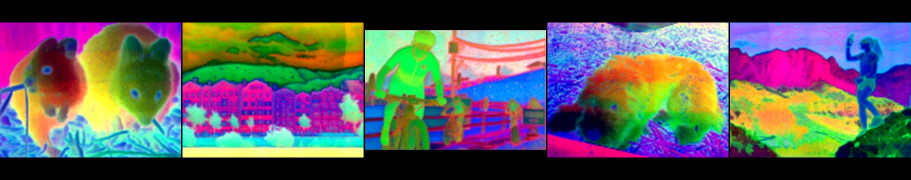

近年来，少数视觉基础模型 (VFM) 已经成为众多下游任务的支柱。像 CLIP、DINOv2、SAM 这样的 VFM 使用不同的目标进行训练，展现出针对各种下游任务的独特特征。我们发现，尽管它们在概念上存在差异，但这些模型可以通过多教师蒸馏有效地合并成一个统一的模型。我们将这种方法命名为 AM-RADIO（聚合模型——将所有领域简化为一个）。这种集成方法不仅超越了个别教师模型的性能，还融合了它们的独特功能，例如零样本视觉语言理解、详细的像素级理解和开放词汇分割能力。为了追求最具硬件效率的骨干网络，我们使用相同的训练方案在多教师蒸馏流程中评估了许多架构。这导致了一种新架构 (E-RADIO) 的开发，该架构超越了其前辈的性能，并且至少比教师模型快 7 倍。我们全面的基准测试过程涵盖了下游任务，包括 ImageNet 分类、ADE20k 语义分割、COCO 对象检测和 LLaVa-1.5 框架。代码：https://github.com/NVlabs/RADIO 

---

### VFM
#### 1. [Efficient and Discriminative Image Feature Extraction for Universal Image Retrieval](https://arxiv.org/pdf/2409.13513) 发表时间: 2024-09-20

当前的图像检索系统经常面临领域特异性和泛化性问题。本研究旨在通过开发一种计算高效的通用特征提取器训练框架来克服这些限制，该框架可以提供跨多个领域的强大语义图像表示。为此，我们整理了一个名为 M4D-35k 的多领域训练数据集，该数据集支持资源高效的训练。此外，我们对各种最先进的视觉语义基础模型和基于边际的度量学习损失函数进行了广泛的评估和比较，以确定它们对高效通用特征提取的适用性。尽管计算资源有限，但我们在 Google 通用图像嵌入挑战赛上取得了接近最先进水平的结果，mMP@5 为 0.721。这使我们的方法在排行榜上位居第二，仅落后于性能最佳的方法 0.7 个百分点。然而，我们的模型的总体参数减少了 32%，可训练参数减少了 289 倍。与计算需求相似的方法相比，我们的性能比之前的最先进水平高出 3.3 个百分点。我们在 https://github.com/morrisfl/UniFEx 上发布了我们的代码和 M4D-35k 训练集注释。 

---

#### 1. [AM-RADIO: Agglomerative Vision Foundation Model -- Reduce All Domains Into One](https://arxiv.org/abs/2312.06709) 发表时间: 2023-12-10

近来，少数视觉基础模型 (VFM) 已经成为众多下游任务的支柱。像 CLIP、DINOv2、SAM 这样的 VFM 使用不同的目标进行训练，针对各种下游任务展现出独特的特性。我们发现，尽管它们在概念上存在差异，但这些模型可以通过多教师蒸馏有效地合并成一个统一的模型。我们将这种方法命名为 AM-RADIO（聚合模型 - 将所有领域简化为一）。这种集成方法不仅超越了单个教师模型的性能，还融合了它们各自的特性，例如零样本视觉语言理解、详细的像素级理解和开放词汇分割能力。为了追求最具硬件效率的骨干网络，我们使用相同的训练方法在多教师蒸馏流程中评估了众多架构。这促成了一种新架构 (E-RADIO) 的开发，该架构超越了其前辈的性能，并且至少比教师模型快 7 倍。我们全面的基准测试过程涵盖了下游任务，包括 ImageNet 分类、ADE20k 语义分割、COCO 对象检测和 LLaVa-1.5 框架。代码：https://github.com/NVlabs/RADIO 

---

### diffusion

#### 1. [Fine-Tuning Image-Conditional Diffusion Models is Easier than You Think](https://arxiv.org/abs/2409.11355) 发表时间: 2024-09-17

最近的研究表明，大型扩散模型可以通过将深度估计视为图像条件图像生成任务，重新用于高精度单目深度估计。虽然所提出的模型取得了最先进的结果，但由于多步推理导致的高计算需求限制了它在许多场景中的使用。在本文中，我们发现，感知到的低效率是由推理流程中的一个缺陷造成的，这个缺陷到目前为止还没有被注意到。修复后的模型在性能上与之前报道的最佳配置相当，但速度提高了200多倍。为了优化下游任务性能，我们在单步模型的基础上使用特定于任务的损失函数进行端到端的微调，并得到了一个确定性模型，该模型在常见的零样本基准测试中优于所有其他基于扩散的深度和法线估计模型。我们惊奇地发现，这种微调协议也直接适用于稳定扩散模型，并取得了与当前最先进的基于扩散的深度和法线估计模型相当的性能，这对从先前工作中得出的一些结论提出了质疑。 

---

#### 2. [Playground v3: Improving Text-to-Image Alignment with Deep-Fusion Large Language Models](https://arxiv.org/abs/2409.10695) 发表时间: 2024-09-16

我们推出了最新的文本到图像模型 Playground v3 (PGv3)，该模型在多个测试基准上实现了最先进的 (SoTA) 性能，在图形设计能力方面表现出色，并引入了新的功能。与依赖于 T5 或 CLIP 文本编码器等预训练语言模型的传统文本到图像生成模型不同，我们的方法将大型语言模型 (LLM) 与一种新颖的结构完全集成，该结构仅利用来自仅解码器 LLM 的文本条件。此外，为了提高图像描述质量，我们开发了一种内部描述器，能够生成不同详细程度的描述，从而丰富文本结构的多样性。我们还引入了一个新的基准 CapsBench 来评估详细的图像描述性能。实验结果表明，PGv3 在文本提示 adherence、复杂推理和准确的文本渲染方面表现出色。用户偏好研究表明，我们的模型在常见的设计应用（如贴纸、海报和徽标设计）方面具有超人的图形设计能力。此外，PGv3 还引入了新的功能，包括精确的 RGB 颜色控制和强大的多语言理解能力。 

---

#### 3. [Tutorial on Diffusion Models for Imaging and Vision](https://arxiv.org/abs/2403.18103) 发表时间: 2024-03-26

近年来，生成式工具的惊人发展促进了许多令人兴奋的应用，例如文本到图像生成和文本到视频生成。这些生成式工具背后的基本原理是扩散的概念，这是一种特殊的采样机制，它克服了以往方法中被认为难以解决的一些缺点。本教程的目标是讨论扩散模型的基本思想。本教程的目标受众包括有兴趣研究扩散模型或应用这些模型解决其他问题的本科生和研究生。 

---

### Data_Synthesis

#### 1. [Magpie: Alignment Data Synthesis from Scratch by Prompting Aligned LLMs with Nothing](https://arxiv.org/abs/2406.08464) 发表时间: 2024-06-12

高质量的指令数据对于对齐大型语言模型 (LLM) 至关重要。尽管一些模型（如 Llama-3-Instruct）具有开放权重，但它们的校准数据仍然是私有的，这阻碍了人工智能的民主化。高昂的人工成本和有限的、预定义的提示范围阻碍了现有开源数据创建方法的有效扩展，这可能会限制公共校准数据集的多样性和质量。是否可以通过直接从校准的 LLM 中提取高质量的指令数据来大规模合成？我们提出了一种名为 Magpie 的自合成方法，用于生成大规模校准数据。我们的主要观察结果是，像 Llama-3-Instruct 这样的校准 LLM 可以在我们仅输入左侧模板到为用户消息保留的位置时生成用户查询，这要归功于它们的自动回归性质。我们使用这种方法来提示 Llama-3-Instruct 并生成 400 万条指令及其相应的响应。我们对提取的数据进行了全面分析，并选择了 300K 个高质量实例。为了将 Magpie 数据与其他公共指令数据集进行比较，我们使用每个数据集微调 Llama-3-8B-Base，并评估微调模型的性能。我们的结果表明，在某些任务中，使用 Magpie 微调的模型的性能与官方 Llama-3-8B-Instruct 相当，尽管后者通过监督微调 (SFT) 和后续反馈学习增强了 1000 万个数据点。我们还表明，仅将 Magpie 用于 SFT 可以超越之前用于 SFT 和偏好优化的公共数据集的性能，例如使用 UltraFeedback 进行直接偏好优化。这种优势在校准基准测试中很明显，例如 AlpacaEval、ArenaHard 和 WildBench。 

---

#### 2. [UWStereo: A Large Synthetic Dataset for Underwater Stereo Matching](https://arxiv.org/abs/2409.01782) 发表时间: 2024-09-03

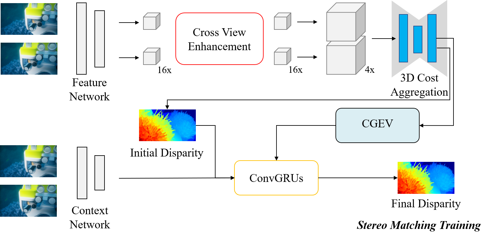

尽管立体匹配技术近期取得了进展，但其扩展到复杂的水下环境仍然 unexplored，这主要是由于：1）水下图像的能见度降低、对比度低和其他不利影响；2）难以获得用于训练深度学习模型的 ground truth 数据，例如，在水下环境中同时捕捉图像并估计其相应的像素级深度信息。为了推动水下立体匹配的进一步发展，我们引入了一个名为 UWStereo 的大型合成数据集。我们的数据集包含 29,568 对合成立体图像对，并带有密集且准确的左视图视差标注。我们设计了四个不同的水下场景，其中充满了各种物体，如珊瑚、船舶和机器人。我们还引入了相机模型、照明和环境效果方面的其他变化。与现有的水下数据集相比，UWStereo 在规模、变化、标注和照片级图像质量方面都更胜一筹。为了证实 UWStereo 数据集的有效性，我们与九种最先进的算法进行了全面比较评估。结果表明，当前的模型仍然难以泛化到新的领域。因此，我们设计了一种新的策略，在立体匹配训练之前学习重建跨域遮罩图像，并集成跨视图注意力增强模块，聚合远程内容信息以增强泛化能力。

---

### gs_nerf

#### 1. [GLC-SLAM: Gaussian Splatting SLAM with Efficient Loop Closure](https://arxiv.org/abs/2409.10982) 发表时间: 2024-09-17

三维高斯拟合 (3DGS) 因其在密集同步定位与建图 (SLAM) 中的应用而备受关注，因为它能够实现实时渲染和高保真度建图。然而，现有的基于 3DGS 的 SLAM 方法经常受到累积跟踪误差和地图漂移的影响，特别是在大规模环境中。为了解决这些问题，我们引入了 GLC-SLAM，一种集成了相机姿态和场景模型全局优化的高斯拟合 SLAM 系统。我们的方法采用帧到模型跟踪，并使用全局到局部策略触发分层闭环，以最大程度地减少漂移累积。通过将场景划分为 3D 高斯子图，我们可以在大场景中轻松地在闭环校正后进行地图更新。此外，我们不确定性最小化的关键帧选择策略优先考虑观察到更有价值的 3D 高斯的关键帧，以增强子图优化。在各种数据集上的实验结果表明，与最先进的密集 RGB-D SLAM 系统相比，GLC-SLAM 实现了更好或相当的跟踪和建图性能。 

---

#### 2. [Improving 2D Feature Representations by 3D-Aware Fine-Tuning](https://arxiv.org/abs/2407.20229) 发表时间: 2024-07-29

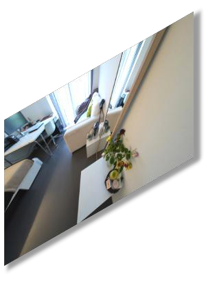

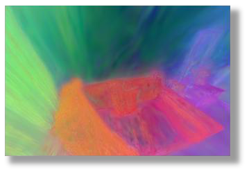

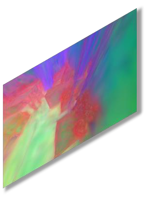

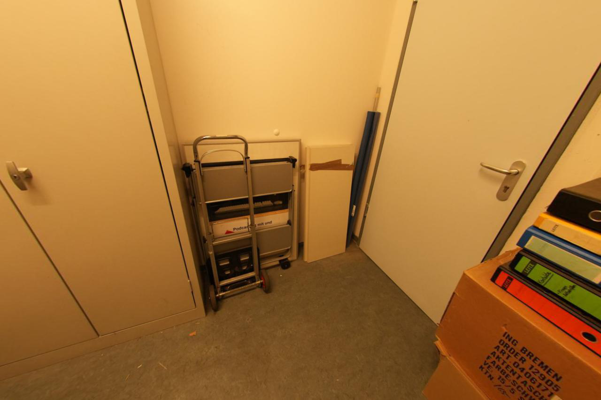

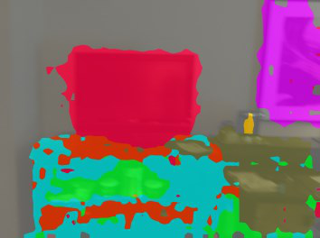

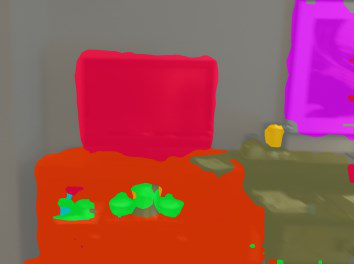

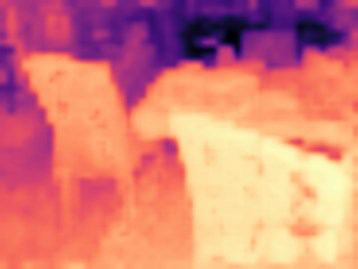

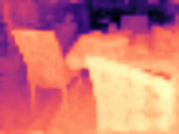

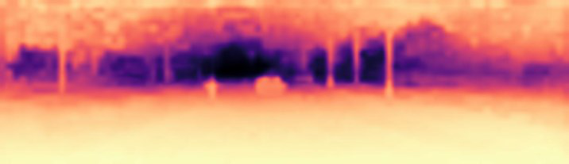

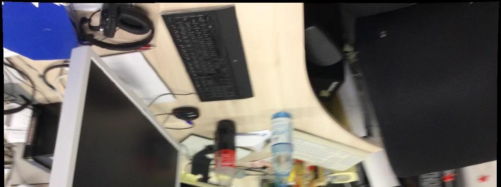

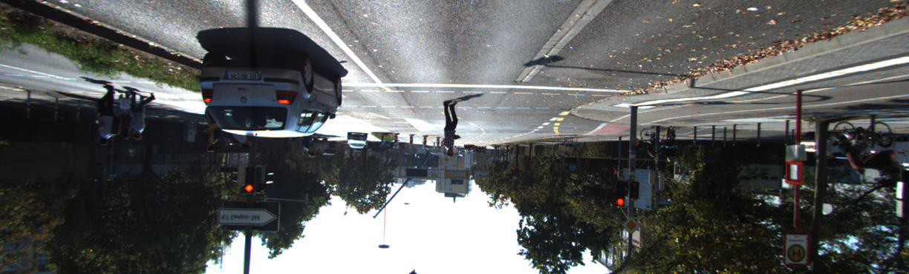

当前的视觉基础模型仅仅在非结构化的二维数据上进行训练，这限制了它们对物体和场景三维结构的理解。在本研究中，我们展示了在具有三维感知能力的数据上进行微调可以提高新兴语义特征的质量。我们设计了一种将二维语义特征提升为高效三维高斯表示的方法，该方法允许我们针对任意视角重新渲染这些特征。利用渲染后的具有三维感知能力的特征，我们设计了一种微调策略，将这种三维感知能力迁移到二维基础模型中。我们证明，以这种方式微调的模型所产生的特征可以通过简单的线性探测 readily 提高语义分割和深度估计等下游任务的性能。值得注意的是，尽管是在单个室内数据集上进行微调，但这种改进可以迁移到各种室内数据集和域外数据集。我们希望我们的研究能够鼓励社区在训练二维基础模型时考虑注入三维感知能力。项目页面：https://ywyue.github.io/FiT3D。 

---

#### 3. [GS-Net: Generalizable Plug-and-Play 3D Gaussian Splatting Module](https://arxiv.org/abs/2409.11307) 发表时间: 2024-09-17

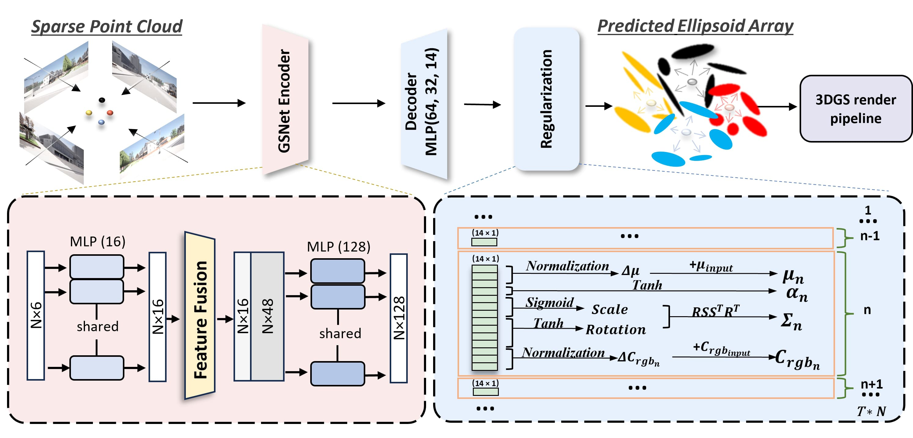

三维高斯 splatting (3DGS) 结合了基于图元的表示方法和体积渲染技术的优势，实现了实时的、高质量的渲染。然而，3DGS 模型通常过度拟合单场景训练，并且对高斯椭球的初始化非常敏感，这些椭球是从运动恢复结构 (SfM) 点云中启发式地导出的，这限制了其泛化能力和实用性。为了解决这些限制，我们提出了 GS-Net，这是一个可泛化的、即插即用的 3DGS 模块，它可以从稀疏的 SfM 点云中 densify 高斯椭球，增强几何结构表示。据我们所知，GS-Net 是第一个具有跨场景泛化能力的即插即用 3DGS 模块。此外，我们还介绍了 CARLA-NVS 数据集，该数据集包含额外的相机视点，可以全面评估重建和渲染质量。大量实验表明，将 GS-Net 应用于 3DGS 后，传统视点的 PSNR 提高了 2.08 dB，新视点的 PSNR 提高了 1.86 dB，证实了该方法的有效性和鲁棒性。 

---

### architecture

#### 1. [Kolmogorov-Arnold Transformer](https://arxiv.org/abs/2409.10594) 发表时间: 2024-09-16

Transformer 是现代深度学习的基石。传统上，这些模型依靠多层感知器 (MLP) 层来混合通道之间的信息。在本文中，我们介绍了 Kolmogorov-Arnold Transformer (KAT)，这是一种新颖的架构，它用 Kolmogorov-Arnold Network (KAN) 层取代了 MLP 层，以增强模型的表达能力和性能。 然而，将 KAN 集成到 Transformer 中并非易事，尤其是在扩展时。具体来说，我们确定了三个关键挑战：(C1) 基函数。KAN 中使用的标准 B 样条函数没有针对现代硬件上的并行计算进行优化，导致推理速度变慢。(C2) 参数和计算效率低下。KAN 要求为每个输入-输出对使用唯一函数，这使得计算量非常大。(C3) 权重初始化。由于 KAN 的可学习激活函数，其权重初始化特别具有挑战性，这对于实现深度神经网络的收敛至关重要。为了克服上述挑战，我们提出了三个关键解决方案：(S1) 有理基。我们用有理函数替换 B 样条函数，以提高与现代 GPU 的兼容性。通过在 CUDA 中实现这一点，我们实现了更快的计算。(S2) 组 KAN。我们通过一组神经元共享激活权重，以在不牺牲性能的情况下减少计算负载。(S3) 方差保持初始化。我们仔细初始化激活权重，以确保跨层保持激活方差。通过这些设计，KAT 可以有效地扩展并且轻松优于传统的基于 MLP 的 Transformer。 

---

### stereo
#### 1. [Depth Pro: Sharp Monocular Metric Depth in Less Than a Second](https://arxiv.org/abs/2410.02073) 发表时间: 2024-10-02

我们提出了一个用于零样本度量单目深度估计的基础模型。我们的模型 Depth Pro 可以合成具有无与伦比的清晰度和高频细节的高分辨率深度图。预测结果是度量的，具有绝对尺度，不依赖于相机内参等元数据的可用性。而且该模型速度很快，在标准 GPU 上只需 0.3 秒即可生成 225 万像素的深度图。这些特性得益于多项技术贡献，包括用于密集预测的高效多尺度视觉Transformer、结合真实和合成数据集以实现高精度度量和精细边界追踪的训练协议、用于评估估计深度图边界精度的专用指标，以及从单张图像进行焦距估计的最新技术。大量实验分析了具体的设计选择，并证明 Depth Pro 在多个方面优于先前的工作。我们在https://github.com/apple/ml-depth-pro 上发布了代码和权重。 

---

#### 1. [MAC-VO: Metrics-aware Covariance for Learning-based Stereo Visual Odometry](https://arxiv.org/abs/2409.09479v1) 发表时间: 2024-09-14

我们提出了MAC-VO，一种新颖的基于学习的立体视觉里程计，它利用学习的度量感知匹配不确定性来实现双重目的：选择关键点和在位姿图优化中加权残差。与传统的优先考虑富含纹理特征（如边缘）的几何方法相比，我们的关键点选择器采用学习的不确定性，根据全局不一致性过滤掉低质量特征。与为协方差矩阵建模尺度无关的对角权重矩阵的基于学习的算法相比，我们设计了一个度量感知协方差模型来捕捉关键点配准过程中的空间误差以及不同轴之间的相关性。将此协方差模型集成到位姿图优化中，增强了位姿估计的鲁棒性和可靠性，特别是在具有变化的光照、特征密度和运动模式的挑战性环境中。在公共基准数据集上，MAC-VO优于现有的VO算法，甚至在具有挑战性的环境中优于一些SLAM算法。协方差图还提供了有关估计位姿可靠性的宝贵信息，这有利于自主系统的决策。

---

